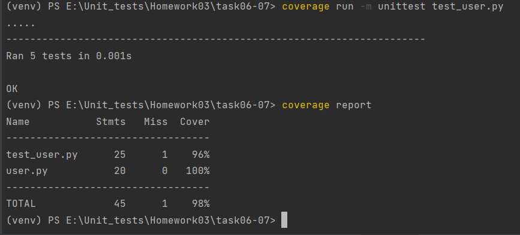
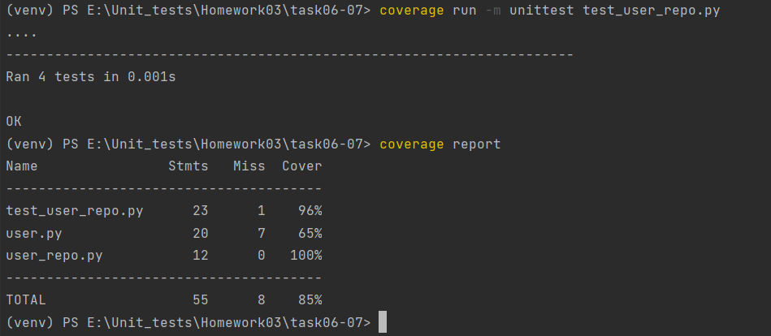
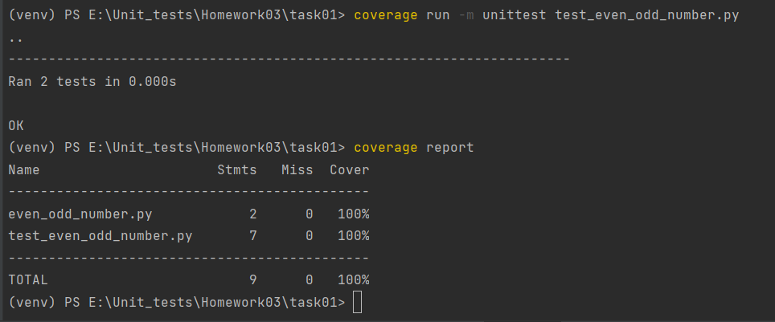
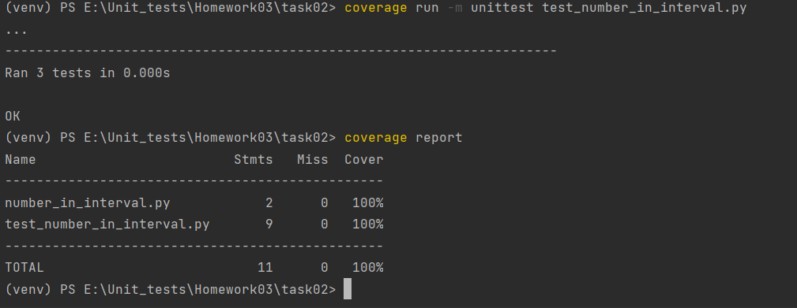

Задание №6
Разработайте класс User с методом аутентификации по логину и паролю. Метод должен возвращать true, если
введенные логин и пароль корректны, иначе false. Протестируйте все методы

Задание №7
Добавьте класс UserRepository для управления пользователями. В этот класс должен быть включен метод
addUser, который добавляет пользователя в систему, если он прошел аутентификацию. Покройте тестами новую
функциональность

Задание 1.

Напишите тесты, покрывающие на 100% метод evenOddNumber, который проверяет, является ли переданное число четным или нечетным. (код приложен в презентации)

Задание 2.

Разработайте и протестируйте метод numberInInterval, который проверяет, попадает ли переданное число в интервал (25;100). (код приложен в презентации)

